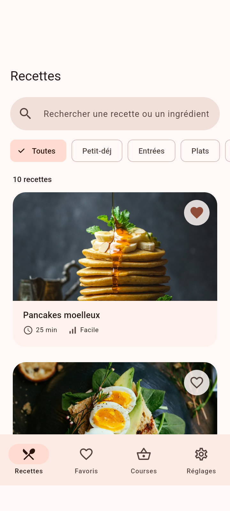
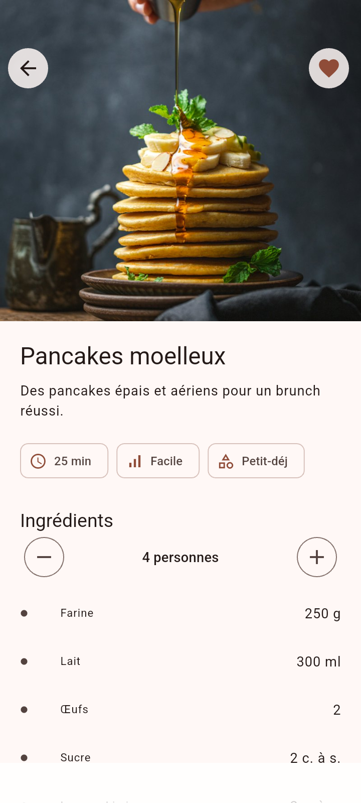
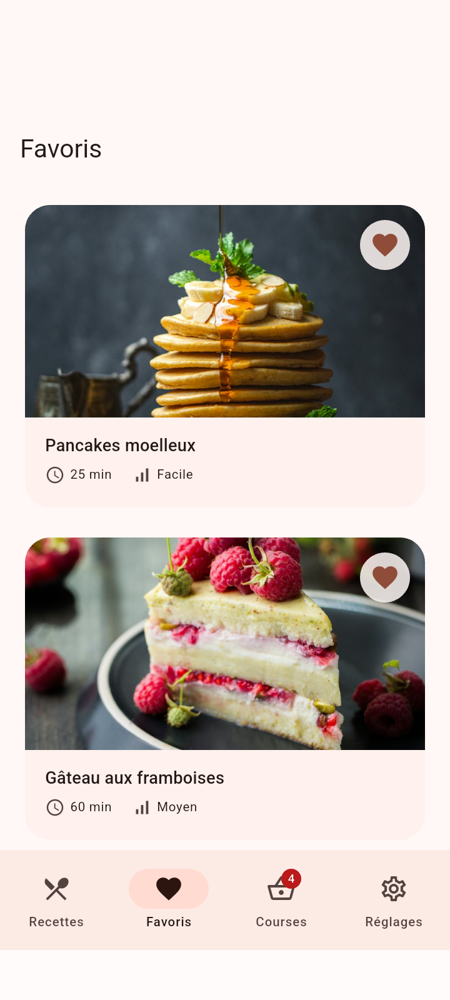
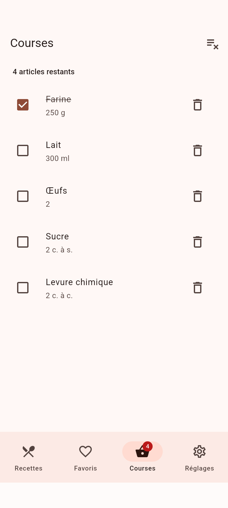
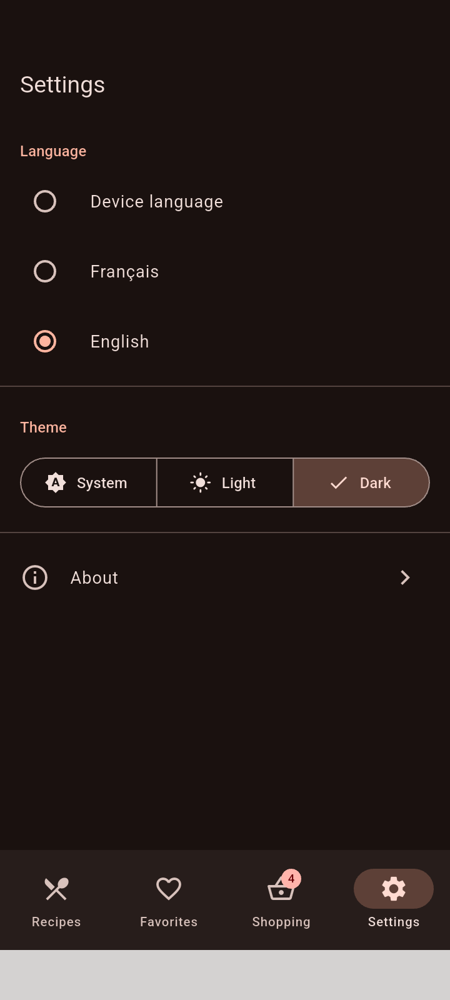
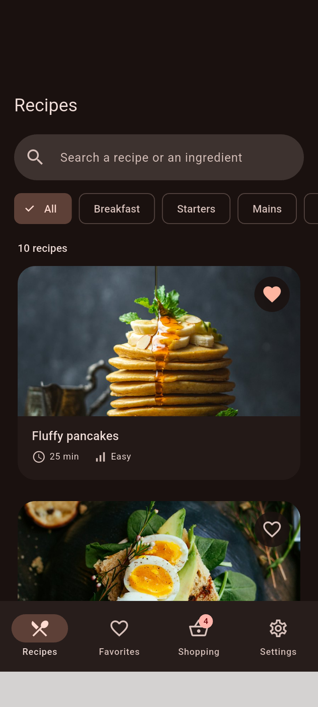

# Recettes — Flutter production-ready

[](https://github.com/darius202/flutter_test_ffsc/actions/workflows/ci.yml)


Application de recettes de cuisine : catalogue avec recherche et filtres, fiche recette avec portions ajustables, favoris, liste de courses et réglages (langue, thème). Le projet sert de vitrine des bonnes pratiques Flutter pour la production : architecture en couches, gestion d'état testable, tests à trois niveaux, accessibilité, internationalisation et CI/CD.

| Recettes | Détail | Favoris |
|:-:|:-:|:-:|
|  |  |  |
| **Courses** | **Settings (EN, sombre)** | **Recipes (EN, sombre)** |
|  |  |  |

## Fonctionnalités

| Écran | Route | Contenu |
|---|---|---|
| Recettes | `/recipes` | Grille lazy, recherche debouncée (insensible à la casse et aux accents, sur les titres et les ingrédients), filtres par catégorie |
| Détail | `/recipes/:id` | Image Hero, portions de 1 à 20 avec recalcul des quantités, ajout à la liste de courses, étapes |
| Favoris | `/favorites` | Recettes favorites, persistées sur l'appareil |
| Courses | `/shopping` | Fusion des ingrédients identiques, cocher, glisser pour supprimer avec annulation, badge dans la barre de navigation |
| Réglages | `/settings` | Langue (appareil / FR / EN), thème (système / clair / sombre) |
| À propos | `/settings/about` | Version, description, licences open source |

## Architecture

```
lib/
├── main.dart                  # Charge SharedPreferences puis lance ProviderScope
├── l10n/                      # app_en.arb (template), app_fr.arb, generated/
└── src/
    ├── app.dart               # MaterialApp.router : thème, locale, routeur
    ├── core/                  # Providers d'infrastructure, routeur, thème, helpers l10n, widgets partagés
    ├── domain/                # Modèles immuables et logique métier pure (sans Flutter UI)
    │   ├── recipe.dart            # Recipe, Ingredient, mise à l'échelle des portions
    │   ├── recipe_filter.dart     # Recherche et filtres
    │   ├── shopping_item.dart     # Fusion des ingrédients
    │   └── localized_text.dart    # Contenu multilingue avec repli
    ├── data/                  # Repositories
    │   ├── recipe_repository.dart       # Interface + implémentation (asset JSON, cache mémoire)
    │   └── preferences_repository.dart  # Persistance locale (SharedPreferences)
    └── features/              # Un dossier par fonctionnalité : écrans, widgets, contrôleurs Riverpod
        ├── recipes/  favorites/  shopping/  settings/  home/
```

Le flux de données va de l'UI vers les providers Riverpod (`Notifier`), puis vers les repositories et la source (asset ou SharedPreferences).

- **Gestion d'état** : `hooks_riverpod`. Les contrôleurs (`FavoritesNotifier`, `ShoppingListNotifier`, `SettingsNotifier`, `RecipeFilterNotifier`) ne dépendent que des repositories, qu'on remplace facilement dans les tests.
- **Navigation** : `go_router` avec `StatefulShellRoute.indexedStack`. Chaque onglet conserve sa pile et sa position de scroll ; le détail s'affiche en plein écran.
- **Hooks** : `flutter_hooks` pour l'état local éphémère (contrôleur de texte, debounce, portions) sans `StatefulWidget`.
- **Contenu bilingue** : chaque recette porte ses textes FR et EN (`LocalizedText`), avec repli sur l'anglais.

## Performance

| Mesure | Détail |
|---|---|
| Listes lazy | `SliverGrid.builder` et `SliverList.builder` : seuls les éléments visibles sont construits, images comprises |
| Hauteur fixe | `mainAxisExtent` évite de mesurer les enfants pendant le scroll |
| Images optimisées | Largeur demandée au CDN selon la taille affichée, `cacheWidth` pour décoder à la taille d'affichage, largeurs arrondies à des paliers pour partager le cache, fondu à l'apparition, placeholder sans décalage de layout |
| Rebuilds ciblés | `select()` Riverpod : un cœur ne se reconstruit que si *son* favori change, le badge seul écoute la liste de courses. Constructeurs `const` partout (lint `prefer_const_constructors`) |
| Recherche | Debounce de 300 ms (hook `useEffect` + `Timer`) |

**Mesure réelle** (test d'intégration `scrolling the catalogue stays smooth`, mode profile, Android 15, Infinix X6728B, 367 frames) :

| | p90 | max |
|---|---|---|
| Build | 1,7 ms | 5,3 ms |
| Raster | 3,9 ms | 7,7 ms |

Toutes les frames tiennent dans le budget de 16 ms (60 fps). En profile/release, le test échoue si le p90 dépasse 16 ms.

## Accessibilité

- Chaque carte recette est annoncée comme un bouton avec un libellé complet (« Pancakes moelleux, 25 minutes, Facile ») ; le bouton favori reste un contrôle séparé.
- Tous les `IconButton` ont un `tooltip`, qui sert aussi de libellé sémantique.
- Titres marqués `header`, compteurs en `liveRegion` (résultats, portions, articles restants), images décoratives exclues de l'arbre sémantique.
- Hauteurs de ligne adaptées au facteur de texte de l'utilisateur.
- Les tests de widgets vérifient `androidTapTargetGuideline`, `iOSTapTargetGuideline` et `labeledTapTargetGuideline` sur quatre écrans.

## Internationalisation

`flutter_localizations` + `gen-l10n` (voir `l10n.yaml`). L'UI (pluriels ICU, séparateur décimal : `1.5` en EN, `1,5` en FR) et le contenu des recettes sont traduits. Par défaut, l'app suit la langue de l'appareil ; le choix fait dans les réglages est persisté.

Pour ajouter une langue : créer `lib/l10n/app_xx.arb`, puis lancer `flutter gen-l10n`.

## Tests

| Niveau | Fichier | Nombre | Couvre |
|---|---|---|---|
| Unitaires | `test/unit/domain_test.dart` | 17 | Parsing, mise à l'échelle, recherche/accents, fusion des courses |
| Unitaires | `test/unit/repositories_test.dart` | 8 | Repositories (AssetBundle mocké avec `mocktail`, cache, retry, données corrompues) |
| Unitaires | `test/unit/providers_test.dart` | 10 | Notifiers Riverpod, persistance, formatage |
| Widgets | `test/widget/screens_test.dart` | 17 | Tous les écrans, debounce, i18n, annuler, états vide/erreur, guidelines a11y |
| Intégration | `integration_test/app_test.dart` | 3 | Parcours complets sur l'app réelle et mesure de performance |

```bash
flutter test                                    # unitaires + widgets
flutter test --coverage                         # avec couverture (coverage/lcov.info)
flutter test integration_test -d <device>       # intégration sur appareil/émulateur

# Rapport de performance en mode profile
flutter drive --profile --driver=test_driver/perf_driver.dart \
  --target=integration_test/app_test.dart -d <device>

# Régénérer les captures du README
flutter drive --profile --driver=test_driver/screenshot_driver.dart \
  --target=test_driver/screenshots_test.dart -d <device>
```

## Installation

Prérequis : Flutter 3.35.7 (Dart 3.9), Android SDK ou Xcode.

```bash
git clone https://github.com/darius202/flutter_test_ffsc.git
cd flutter_test_ffsc
flutter pub get
flutter gen-l10n
flutter run
```

Build : `flutter build apk --release` (Android) ou `flutter build ipa` (iOS, signature requise).

## CI/CD

`.github/workflows/ci.yml`, déclenché à chaque push sur `main`, sur les pull requests et sur les tags `v*` :

1. **Lint & tests** : `dart format` vérifié, `flutter analyze --fatal-infos --fatal-warnings`, `flutter test --coverage` (lcov en artefact).
2. **Integration tests** : émulateur Android API 34 et `flutter test integration_test`.
3. **Build APK** : APK release (universel + par ABI) en artefact ; sur un tag `v*`, publication automatique d'une GitHub Release avec les APK.

**APK de démonstration** : onglet *Actions*, dernier run, artefact `apk`, ou page *Releases* après un tag (`git tag v1.2.0 && git push --tags`).

## Stack

`hooks_riverpod` · `flutter_hooks` · `go_router` · `shared_preferences` · `intl` · `flutter_localizations` · `mocktail` · `integration_test` · `flutter_lints`

Photos : [Unsplash](https://unsplash.com).
